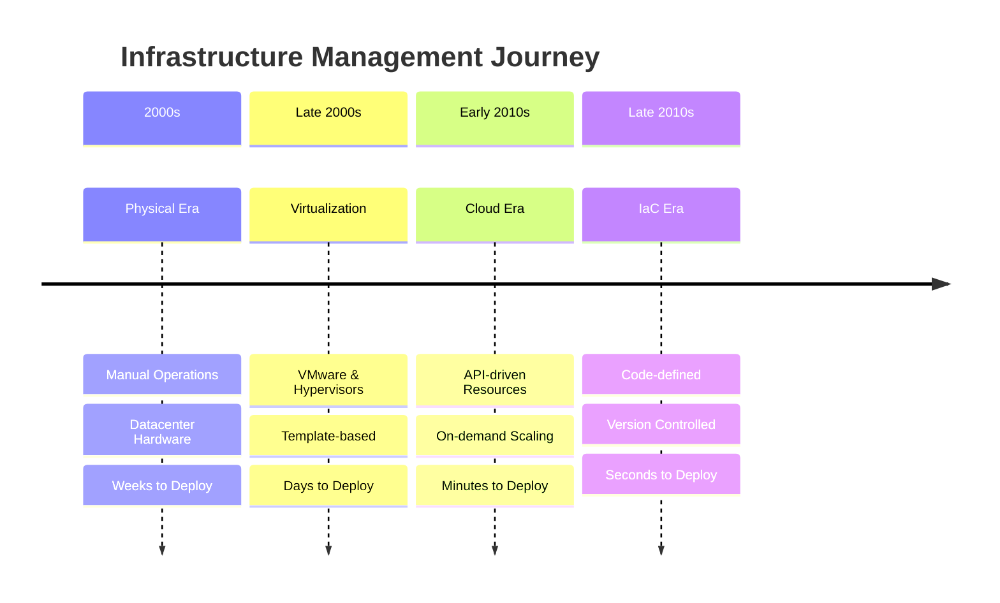
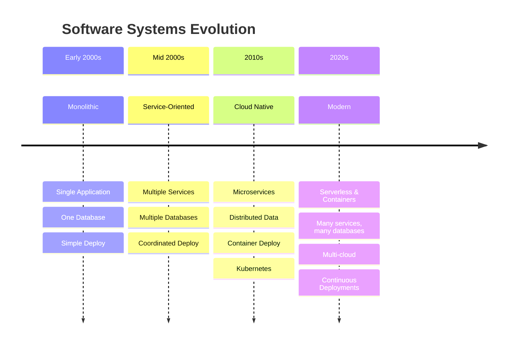

# Evolution of Infrastructure & Systems

Two parallel revolutions that shaped modern computing

<!--
# Speaker Notes

Setup:
- Frame history as context for modern tools
- Set expectation for parallel stories
- Connect to their development experience

Key Points:
- Two revolutions happened together
- Each drove the other forward
- Still evolving today

Questions/Engagement:
- "What infrastructure changes have you seen?"
- "How has development changed with it?"

Next:
- Let's look at infrastructure changes first
-->

---
layout: center
hideInToc: true
---

# Infrastructure Evolution Timeline
Major shifts in how we manage infrastructure over decades

<!--
# Speaker Notes

Setup:
- Visualize the transformation scale
- Focus on speed of change
- Note accelerating pace

Key Points:
- Each jump brought 10x improvement
- Changed how we think about servers
- Automation became essential

Questions/Engagement:
- "When did you start working with cloud?"
- "Which era's tools do you use?"

Next:
- See how these changes affected teams
-->

---
layout: center
hideInToc: true
---

# Infrastructure Evolution Metrics
Quantifying the impact of infrastructure transformation

<table class="metrics-table">
  <thead>
    <tr>
      <th>Era</th>
      <th>Time to Provision</th>
      <th>Servers per Admin</th>
    </tr>
  </thead>
  <tbody>
    <tr v-click="1">
      <td>Physical</td>
      <td>Weeks</td>
      <td>10</td>
    </tr>
    <tr v-click="2">
      <td>Virtual</td>
      <td>Days</td>
      <td>100</td>
    </tr>
    <tr v-click="3">
      <td>Cloud</td>
      <td>Minutes</td>
      <td>500</td>
    </tr>
    <tr v-click="4">
      <td>IaC</td>
      <td>Seconds</td>
      <td>1000+</td>
    </tr>
  </tbody>
</table>

<!--
# Speaker Notes

Setup:
- These metrics don't show real impact, mostly ilustrate to idea
- Focus on two key metrics

Key Points:
- Deployment time: 10000x faster
- Admin capacity: 100x increase
- Every step multiplied capability

Questions/Engagement:
- "What enabled each jump?"
- "Which metric matters more?"

Next:
- Look at what drove these changes
-->

---
layout: center
hideInToc: true
---

# Systems Architecture Evolution
How software systems grew in complexity and scale

<!--
# Speaker Notes

Setup:
- Connect to their software experience
- System architecture drove infrastructure
- Still happening today

Key Points:
- Monolith: Simple but limiting
- Services: Team independence
- Cloud Native: Infrastructure complexity
- Modern: Mix of approaches

Questions/Engagement:
- "Have you worked on any team projects?"
- "Which architectures have you worked with?"
- "What drove your architecture choices?"

Next:
- See how this affected operations
-->

---
layout: center
hideInToc: true
---

# Key System Characteristics

<v-clicks>

- Monolithic: One team, one deploy, one database
- Service-Oriented: Multiple teams, coordinated deploys
- Cloud Native: Many small services, continuous deployment
- Modern: Mix of serverless, containers, and cloud services

</v-clicks>

💡 More Components = More Infrastructure Complexity

<!--
# Speaker Notes

Setup:
- Each stage brought new challenges
- Progress wasn't always smooth
- Different teams moved at different speeds

Expand on each point:
- Monolithic: Like your early one person projects - simple stack
- SOA: Teams start interfering with each other, need coordination
- Cloud Native: Kubernetes entered the scene and more complex automated orchestration becomes accesible
- Modern: Mix of approaches based on needs

Key message: Infrastructure complexity follows system complexity - this is why we need better tools and practices.

Question to ask: "What architectures have you seen and worked with?"
-->

---
layout: center
hideInToc: true
---

# The Pets vs Cattle Revolution
A fundamental shift in infrastructure mindset

  

    
🐈

    
Named Servers

    
("db-master")

  

  

    →
  

  

    
🐄

    
Numbered Resources

    
("web-042")

  

<!--
# Speaker Notes

Setup:
- Fundamental mindset shift
- Changed how we manage servers
- Still relevant today

Key message: Fundamental shift in how we think about servers

Additional context to mention:
- Pets: We care for them individually, nurse them back to health
- Cattle: Replaceable, automated management
- Like your laptop (pet) vs a Docker container (cattle)
- This mindset shift enabled modern cloud scaling

Questions/Engagement:
- "Where do you see each approach?"
- "Which fits cloud better?"-->

---
layout: center
hideInToc: true
---

# Quick Questions

  

    Who has deployed to the cloud?
  

  

    Experience with infrastructure tools?
  

  

    Automated deployment experience (CI/CD)?
  

  

    Which tech stack?
  

<!--
# Speaker Notes

Setup:
- Quick audience check
- Keep it light and interactive
- Watch for experience distribution

Key Points:
- Note cloud familiarity
- Infrastructure tool exposure
- Cloud provider preferences

Questions/Engagement:
- Use raised hands for each point
- Note which tools are familiar

Next:
- Adjust examples based on responses
-->