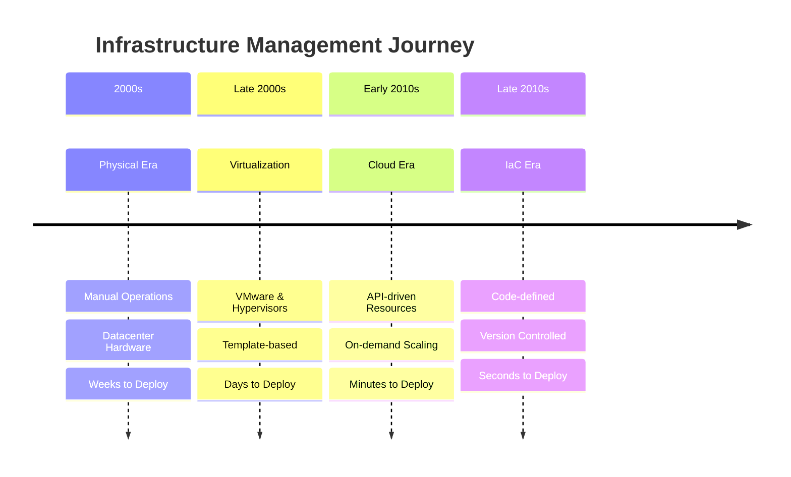
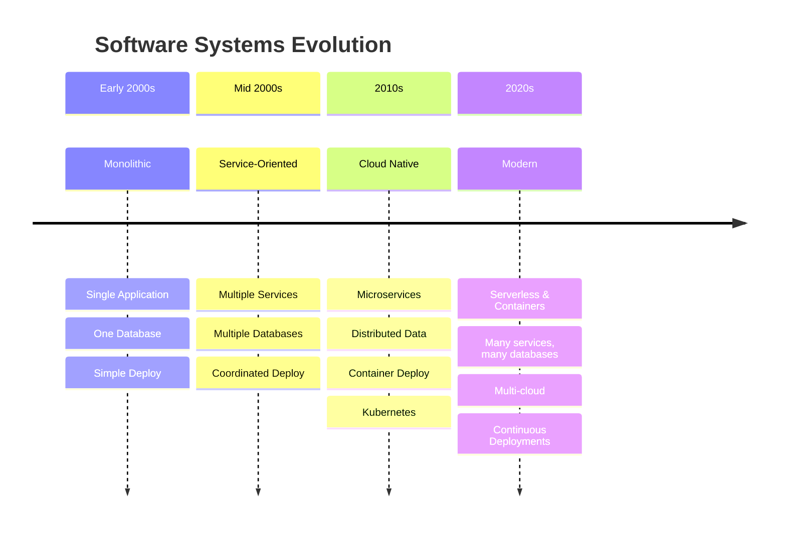

# Evolution of Infrastructure & Systems

Two parallel revolutions that shaped modern computing

<!--
# Speaker Notes
- Little bit of history to explain where IaC comes from
- Two main trends in the last 20 years
- They both lead to increase of complexity in our infrastructure
-->

---
layout: center
hideInToc: true
---

# Infrastructure Evolution Timeline
Major shifts in how we manage infrastructure over decades

<!--
# Speaker Notes
- Start with simple timeline view
- Emphasize the progression of speed and the introduction of on-demand scaling
- Point out key technology shifts
-->

---
layout: center
hideInToc: true
---

# Infrastructure Evolution Metrics
Quantifying the impact of infrastructure transformation

<table class="metrics-table">
  <thead>
    <tr>
      <th>Era</th>
      <th>Time to Provision</th>
      <th>Servers per Admin</th>
    </tr>
  </thead>
  <tbody>
    <tr v-click="1">
      <td>Physical</td>
      <td>Weeks</td>
      <td>10</td>
    </tr>
    <tr v-click="2">
      <td>Virtual</td>
      <td>Days</td>
      <td>100</td>
    </tr>
    <tr v-click="3">
      <td>Cloud</td>
      <td>Minutes</td>
      <td>500</td>
    </tr>
    <tr v-click="4">
      <td>IaC</td>
      <td>Seconds</td>
      <td>1000+</td>
    </tr>
  </tbody>
</table>

<!--
# Speaker Notes

Key points to highlight:
- Each era brings order of magnitude improvement
- Provision time: Weeks → Seconds (10000x faster)
- Scale: 10 → 1000+ servers (100x capacity)

Questions for engagement:
- "What technological changes enabled each jump?"
- "Why did organizations need this scale?"
- "What skills were needed at each stage?"
-->
---
layout: center
hideInToc: true
---

# Systems Architecture Evolution
How software systems grew in complexity and scale

<!--
# Speaker Notes
- Connect to their software development experience
- Point out increasing complexity
- Show how infrastructure needs grew
-->

---
layout: center
hideInToc: true
---

# Key System Characteristics

<v-clicks>

- Monolithic: One team, one deploy, one database
- Service-Oriented: Multiple teams, coordinated deploys
- Cloud Native: Many small services, continuous deployment
- Modern: Mix of serverless, containers, and cloud services

</v-clicks>

💡 More Components = More Infrastructure Complexity

<!--
# Speaker Notes

Expand on each point:
- Monolithic: Like your early one person projects - simple stack
- SOA: Teams start interfering with each other, need coordination
- Cloud Native: Kubernetes entered the scene and more complex automated orchestration becomes accesible
- Modern: Mix of approaches based on needs

Additional context to mention:
- Each stage requires more automation
- Manual processes don't scale
- Teams need independence
- Configuration becomes critical

Key message: Infrastructure complexity follows system complexity - this is why we need better tools and practices.

Question to ask: "What architectures have you seen and worked with?"
-->

---
layout: center
hideInToc: true
---

# The Pets vs Cattle Revolution
A fundamental shift in infrastructure mindset

  

    
🐈

    
Named Servers

    
("db-master")

  

  

    →
  

  

    
🐄

    
Numbered Resources

    
("web-042")

  

<!--
# Speaker Notes

Key message: Fundamental shift in how we think about servers

Additional context to mention:
- Pets: We care for them individually, nurse them back to health
- Cattle: Replaceable, automated management
- Like your laptop (pet) vs a Docker container (cattle)
- This mindset shift enabled modern cloud scaling

Question: "Which approach do you use in your projects?"
-->
---
layout: center
hideInToc: true
---

# Quick Questions

  

    Who has deployed to the cloud?
  

  

    Experience with infrastructure tools?
  

  

    Automated deployment experience?
  

  

    Which cloud providers?
  

<!--
# Speaker Notes

Interaction approach:
- Ask for raised hands
- Note the distribution of experience
- Use this to adjust upcoming examples

Look for:
- AWS/Azure experience for examples
- Prior automation experience
- Tools they're familiar with
- Which concepts need more explanation
-->