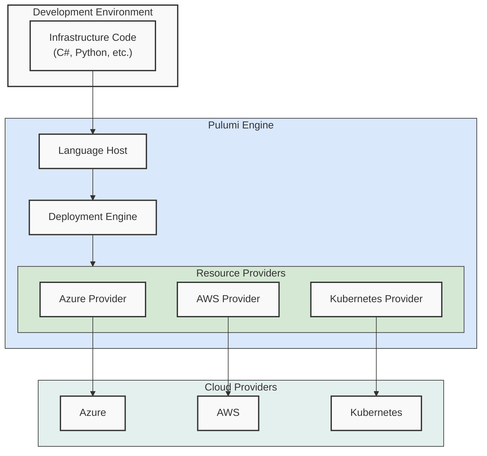

# Pulumi

<div class="opacity-80 italic mb-4">
Using real code to manage infrastructure
</div>

---
layout: default
hideInToc: true
---

# What Makes Pulumi Different

## Specialized DSL
```hcl
# Terraform HCL
resource "azurerm_container_app" "example" {
  name                = "example-app"
  resource_group_name = azurerm_resource_group.example.name
}
```

## Real Programming Language
```csharp
// C# with Pulumi
var app = new ContainerApp("example-app", new ContainerAppArgs
{
    ResourceGroupName = resourceGroup.Name
});
```

<!--
# Speaker Notes

Key points to emphasize:
- From specialized language to familiar code
- Same end result, different approach
- Benefits of real programming language:
  * IDE support
  * Type safety
  * Code completion

Questions to ask:
- "Which syntax feels more natural to you?"
- "What looks familiar from your C# experience?"

Demo preparation:
- Show quick VS Code comparison
- Highlight IntelliSense in Pulumi
-->
---
layout: center
hideInToc: true
---

# Real-World Example: Container App

```hcl {all|2-3|4-8|10-15|all}
resource "azurerm_container_app" "example" {
  name                         = "example-app"
  resource_group_name         = azurerm_resource_group.example.name
  container_app_environment_id = azurerm_container_app_environment.example.id
  revision_mode               = "Single"
  
  template {
    container {
      name   = "examplecontainer"
      image  = "mcr.microsoft.com/azuredocs/containerapps-helloworld:latest" //Not a real app - fix it
      cpu    = 0.25
      memory = "0.5Gi"
    }
  }
}
```

<!--
# Speaker Notes

Key points to emphasize:
- Real infrastructure example
- Multiple configuration levels
- Resource dependencies
- Default values and conventions

Questions to ask:
- "What might be challenging about maintaining this?"
- "How would you handle multiple similar deployments?"
- "What if you need to change all CPU values?"

Engagement strategy:
1. Walk through each section
2. Point out nested configuration
3. Highlight dependency management
-->
---
layout: center
hideInToc: true
---

# Same Resource in Pulumi

```csharp {all|1-2|4-5|7-13|all}
// Define container app with strongly-typed configuration
var app = new ContainerApp("example-app", new ContainerAppArgs
{
    ResourceGroupName = resourceGroup.Name,
    ManagedEnvironmentId = environment.Id,
    Template = new TemplateArgs
    {
        Containers = {
            new ContainerArgs
            {
                Name = "examplecontainer",
                Image = "mcr.microsoft.com/azuredocs/containerapps-helloworld:latest",
                Resources = ContainerResources.GetResources(cpuCount: 0.25, gibibytesOfMemory: 0.5)
            }
        }
    }
});
```

<!--
# Speaker Notes

Key points to emphasize:
- Same infrastructure, different approach
- Strong typing prevents errors
- Named parameters improve readability
- Helper methods available (GetResources)

Questions to ask:
- "What C# features could help manage this?"
- "How would refactoring work here?"
- "Where could we extract reusable code?"

Demo preparation:
- Show IntelliSense in action
- Demonstrate refactoring
- Show type checking
-->
---
layout: two-cols-header
hideInToc: true
---

# Building Abstractions

Turning infrastructure code into reusable components

::left::

## Raw Pulumi
```csharp {all|1-2|3-8|all}
// Basic database setup
var database = new Database("demo-db", new DatabaseArgs
{
    ResourceGroupName = resourceGroup.Name,
    ServerName = sqlServer.Name,
    Sku = new SkuArgs
    {
        Name = config.Get("database-sku")
    }
});
```

::right::

## High-level SDK
```csharp {all|1-2|3|4|all}
// High-level patterns
var database = new SqlDatabase("demo")
    .InResourceGroup(resourceGroup)
    .WithBasicTier();
```

<!--
# Speaker Notes

Key points to emphasize:
- SDK encapsulates complexity
- Fluent interface for readability
- Built-in best practices
- Reduced cognitive load

Questions to ask:
- "How does this help new team adopters?"
-->
---
layout: two-cols-header
hideInToc: true
---

# Core Concepts

How Pulumi organizes infrastructure code

::left::

## Project
```yaml {all|2|3|4-5|all}
name: container-app
runtime: dotnet
description: Base container app template
```
- Single unit of infrastructure code
- Reusable template for environments
- Shared implementation logic
- Common patterns and structures
- Version controlled as one repo

::right::

## Stacks
```yaml {all|2|3-4|5-6|all}
# Pulumi.dev.yaml
config:
  name: myapp-dev
  size: small
  location: westeurope
  resourceGroup: dev-rg
```
```yaml
# Pulumi.prod.yaml
config:
  name: myapp-prod
  size: large
  location: northeurope
  resourceGroup: prod-rg
```

<!--
# Speaker Notes

Key points to emphasize:
- Project = Template
  * One implementation
  * Shared across environments
  * Define patterns once
  * Version controlled together

- Stacks = Configurations
  * Environment-specific values
  * Different sizing/scaling
  * Regional settings
  * Resource naming

Questions to ask:
- "How is this similar to your application configs?"
- "What kind of values would you put in stack config?"
- "How might this help with environment consistency?"
-->
---
layout: two-cols-header
hideInToc: true
---

# Projects and Stacks in Practice

::left::

## Project Code (Implementation)
```csharp {all|3-4|6-10|12-16|all}
public class MyStack : Stack
{
    // Constructor gets config values
    public MyStack()
    {
        // Get stack-specific values
        var config = new Config();
        var appName = config.Require("name");
        var appSize = config.Require("size");
        var location = config.Require("location");

        // Create resources using config
        var app = new WebApplication(appName)
            .InResourceGroup(resourceGroup)
            .WithSize(appSize)
            .InLocation(location);
    }
}
```

::right::

## Stack Operations
```bash {all|1-2|4-5|7-8|all}
# List available stacks
pulumi stack ls

# Switch to development stack
pulumi stack select dev

# View stack configuration
pulumi config
```

```bash
# Stack operations output
> pulumi config
KEY                 VALUE
location       westeurope
resourceGroup  dev-rg
name           myapp-dev
size           small
```

<!--
# Speaker Notes

Key points to emphasize:
- One implementation, multiple configs
- Stack selection determines values
- Config drives resource creation
- Easy environment switching

Practical examples:
- Development environments
- Regional deployments
- Customer-specific instances
- Testing configurations

Questions to ask:
- "What would you put in config vs code?"
- "How could this help with testing?"
- "What other environments might you need?"
-->
---
layout: center
hideInToc: true
---

# Understanding Resources


```csharp {all|1-2|4-5|7-8|all}
// Resource Definition
var resourceGroup = new ResourceGroup("rg-demo");

// Implicit Dependencies
var server = new SqlServer("sql-demo", new SqlServerArgs { ResourceGroupName = resourceGroup.Name });

// Explicit Dependencies
var app = new ContainerApp("app-demo", new ContainerAppArgs { ... }, new CustomResourceOptions { DependsOn = { server } });
```

<!--
# Speaker Notes

Key points to emphasize:
- Resources are cloud components
- Dependencies can be:
  * Implicit (through properties)
  * Explicit (through DependsOn)
- Pulumi builds dependency graph
- Graph determines deployment order

Resource characteristics:
1. Unique identity
2. Tracked state
3. Dependencies
4. Lifecycle management

Questions to ask:
- "How do you handle dependencies without IaC?"
-->
---
layout: two-cols-header
hideInToc: true
---

# State Management

How Pulumi tracks your infrastructure

::left::

## State Example
```json {all|2-3|4-8|9-12|all}
{
  "version": 3,
  "deployment": {
    "resources": [
      {
        "type": "azure:core/resourceGroup:ResourceGroup", // probably wrong, fix it
        "name": "rg-demo"
      },
      "outputs": {
        "resourceGroupName": "rg-demo",
        "location": "westeurope"
      }
    ]
  }
}
```

::right::

## Backend Options

- **Pulumi Cloud**
  * Managed state storage
  * Team collaboration
  * History and audit
  * RBAC support

- **Self-Hosted**
  * Azure Blob Storage
  * AWS S3

<!--
# Speaker Notes

Key points to emphasize:
- State = Source of truth
- Tracks all resources
- Records dependencies
- Enables team collaboration

Why state matters:
1. Knows what exists
2. Tracks relationships
3. Handles updates
4. Enables cleanup

Questions to ask:
- "What happens if state is lost?"
- "How do you track resources now?"
- "Which backend would you choose?"
-->
---
layout: center
hideInToc: true
---

# Working with State

## Common State Operations

```bash {all|1-2|4-5|7-8|10-11|all}
# View current state
pulumi stack

# Refresh state from cloud
pulumi refresh

# Export state backup
pulumi stack export --file backup.json

# Import state
pulumi stack import --file backup.json
```

## State & Reality


<!--
# Speaker Notes

Key points to emphasize:
- State can drift from reality
- Regular refresh recommended
- Backup state regularly
- Import/export for migration

Common scenarios:
1. Manual changes detection
2. Resource cleanup
3. Team synchronization
4. Disaster recovery

Questions to ask:
- "When might state drift occur?"
- "How would you refresh the state?"
-->
---
hideInToc: true
---

# Language Benefits

## Using C# for Infrastructure
<v-clicks>

- Strong Type System
- IDE Support
- Refactoring Tools
- Testing Framework
- Dependency Management
- Package Ecosystem

</v-clicks>

## Real Development Features
<v-clicks>

- Classes and Inheritance
- Error Handling
- Code Organization
- Documentation Tools
- Code Sharing
- Team Collaboration

</v-clicks>

<!--
# Presenter Notes
- Show IDE benefits later in demo
- Highlight productivity gains
- Compare to YAML/HCL limitations
-->

---
layout: center
hideInToc: true
---

# How Pulumi Works



<!--
# Speaker Notes

Component Roles:

1. Language Host
   - Executes your C# code
   - Manages program runtime
   - Interprets resource declarations
   - Communicates with deployment engine

2. Deployment Engine
   - Heart of Pulumi
   - Compares desired vs current state
   - Orchestrates resource operations
   - Manages dependencies
   - Handles rollbacks

3. Resource Providers
   - Bridge to cloud APIs
   - Handle CRUD operations
   - Validate resource configurations
   - Report operation status

Flow explanation:
1. Your code runs in Language Host
2. Resource declarations sent to Deployment Engine
3. Engine determines required changes
4. Providers execute actual cloud operations

Key benefits:
- Separation of concerns
- Cloud-agnostic core
- Extensible provider model
- Native language experience

Questions to ask:
- "Where would you add new cloud support?"
- "What happens if a provider operation fails?"
-->
---
layout: center
hideInToc: true
---

# Architecture in Action


<!--
# Speaker Notes

Execution flow:
1. Code Declaration
   - Your C# code runs normally
   - Resource constructors create declarations
   - No cloud operations yet

2. Resource Registration
   - Language host tracks resources
   - Builds dependency graph
   - Sends to deployment engine

3. State Comparison
   - Engine checks existing state
   - Determines required changes
   - Plans operations

4. Provider Operations
   - Provider executes changes
   - Reports progress
   - Handles errors
   - Updates state

Key points:
- Async operations
- Error handling at each level
- State updates
- Progress reporting

Questions to ask:
- "Where could errors occur?"
- "How would rollback work?"
- "What happens if remote call fails?"
-->
---