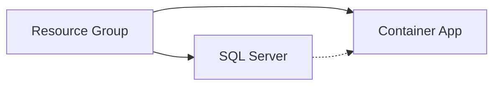
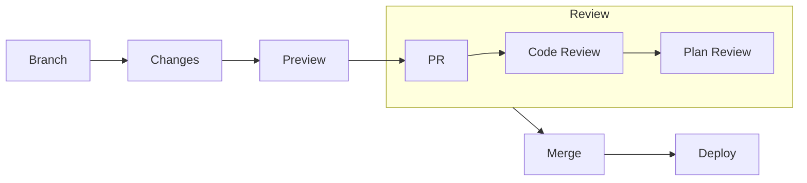

# Demonstration of app environment

<div class="opacity-80 italic mb-4">
Using pulumi to manage cloud environment
</div>

---
layout: center
hideInToc: true
---

# Basic Infrastructure Implementation
Building blocks of our demo environment

<div class="flex justify-center gap-12">
  <div v-click class="resource-group">
    <div class="text-4xl mb-2">🏢</div>
    <div class="text-xl">Resource Group</div>
    <div class="text-sm opacity-75">Logical container</div>
  </div>

  <div v-click class="resource-group">
    <div class="text-4xl mb-2">💾</div>
    <div class="text-xl">SQL Sever and Database</div>
    <div class="text-sm opacity-75">Data storage</div>
  </div>

  <div v-click class="resource-group">
    <div class="text-4xl mb-2">🎯</div>
    <div class="text-xl">Container App and Environment</div>
    <div class="text-sm opacity-75">Application runtime</div>
  </div>
</div>

<div v-click class="mt-12 text-center">
  <div class="text-sm opacity-75">Dependencies flow</div>

</div>

<style>
.resource-group {
  @apply text-center p-4 rounded bg-gray-100 bg-opacity-10;
}
</style>

<!--
# Presenter Notes
- Have Azure Portal open
- VS Code ready with extensions
- Terminal with Azure CLI logged in
- Check Pulumi login status

## Demo Goals

- Show real infrastructure code
- Demonstrate resource dependencies
- Handle secrets properly
- Manage configuration
- Deploy to Azure
-->

---
hideInToc: true
---

# Starting the project

<v-clicks>

1. Configuration
   ```csharp
    var config = new Config();
    var adminUsername = config.Require("sqlAdminUsername");
    var adminPassword = config.RequireSecret("sqlAdminPassword");
   ```

2. Resource Group
   ```csharp
    var resourceGroup = AzureResourceGroup.Create($"mews-pulumi-example-{location.Abbreviation}-tmp", location);
   ```

2. SQL Server
   ```csharp
   var sqlServer = new Server("demo-sql", new ServerArgs
   {
       ResourceGroupName = resourceGroup.Name,
       AdministratorLogin = "adminUser"
   });
   ```

</v-clicks>

<!--
# Presenter Notes
- Type code as you go
- Explain each property
- Show autocompletion
- Highlight dependency tracking
-->

---
hideInToc: true
---

# Adding long lived resources
<v-clicks>

1. Container app environment
   ```csharp
    var containerAppEnvironment = AzureContainerAppEnvironment.Create(
        name: $"pulumi-example-cae--{location.Abbreviation}",
        location: location,
        resourceGroup: resourceGroup,
        logDestination: new AzureMonitorDestination()
    );
   ```

2. SQL Server
   ```csharp
    var sqlServer = AzureSqlServer.Create(
        name: $"pulumi-example-sqlserver-{location.Abbreviation}",
        resourceGroup: resourceGroup,
        location: location,
        adminLogin: adminUsername,
        adminPassword: adminPassword,
        protectFromDeletion: false
    );
   ```

</v-clicks>

---
hideInToc: true
---

# Adding the database

<v-clicks>

## SQL Database
   ```csharp
    var database = AzureSqlDatabase.Create(
        resourceName: $"pulumi-example-database-{location.Abbreviation}",
        databaseName: $"example-app-database",
        resourceGroup: resourceGroup,
        location: location,
        server: sqlServer,
        tier: new StandardDbS2(50),
        readScaleOut: DatabaseReadScale.Disabled,
        zoneRedundant: false,
        highAvailabilityReplicaCount: 0,
        BackupStorageRedundancy.Local
    );
   ```
</v-clicks>

---
hideInToc: true
---

# Adding the app

<v-clicks>

## Container app
  ```csharp
    var app = AzureContainerApp.Create(
        name: $"pulumi-example-app-{location.Abbreviation}",
        resourceGroup: resourceGroup,
        location: location,
        containerName: "test-app",
        containerAppEnvironment: containerAppEnvironment,
        fullImageName: $"",
        containerResources: AzureContainerApp.GetResources(0.5, 2),
        minReplicas: 1,
        maxReplicas: 2,
        environmentVariables: null,
        secrets: null,
        dependsOn: database
    );
  ```
</v-clicks>

<!--
# Presenter Notes
- Explain SKU options
- Show how preview works
- Point out dependency chain
- Discuss production considerations
-->

---
hideInToc: true
---

# Exploring the changes

<v-clicks>

1. Show Preview
   ```bash
   pulumi preview
   ```

2. Check Generated Plan
   - Resource creation order
   - Property settings
   - Dependencies

</v-clicks>

---
hideInToc: true
---

# Live Deployment

## Deployment Steps
<v-clicks>

1. Final Code Review
2. Preview Changes
3. Execute Deployment
4. Verify Resources
5. Check Access

</v-clicks>

<!--
# Presenter Notes
- Run deployment live
- Show Azure portal results
- Verify configurations
- Demonstrate access

## Verification Points
- Resource Creation
- Configuration Application
- Security Settings
- Connectivity
- Monitoring Status
-->

---
hideInToc: true
---

# Making Changes

## Example Modifications
<v-clicks>

1. Change the resource requests for the container app
2. Preview changes
3. Deploy Changes

</v-clicks>

## Key Observations
<v-clicks>

- Change Detection
- State Management
- Dependency Updates
- Resource Protection
- Rollback Options

</v-clicks>

<!--
# Presenter Notes
- Make live changes
- Show state updates
- Demonstrate protection
- Discuss rollback
-->

---
layout: two-cols-header
hideInToc: true
---

# Preview Limitations
Understanding what preview can and cannot catch

::left::

<div v-click class="preview-box">
  <div class="text-xl mb-2">✅ What Preview Shows</div>
  <ul class="text-sm">
    <li>Resource additions/removals</li>
    <li>Property changes</li>
    <li>Basic validation</li>
    <li>Dependencies</li>
  </ul>
</div>

::right::

<div v-click class="preview-box">
  <div class="text-xl mb-2">⚠️ What Preview Misses</div>
  <ul class="text-sm">
    <li>API-specific rules</li>
    <li>Some validation rules</li>
    <li>Runtime conditions</li>
    <li>External dependencies</li>
  </ul>
</div>

<div v-click class="mt-8 mx-4 p-4 rounded bg-blue-500 bg-opacity-10">
  <div class="text-center font-bold">Best Practice</div>
  <div class="text-sm text-center mt-2">
    Always test changes in development environment first
  </div>
</div>

<style>
.preview-box {
  @apply p-4 rounded bg-gray-100 bg-opacity-10;
}
</style>

<!--
# Presenter Notes
- Show preview examples
- Discuss limitations
- Share workaround strategies
- Mention common pitfalls
-->

---
layout: center
hideInToc: true
---

# Team Workflow
Collaborative infrastructure management



<div class="grid grid-cols-2 gap-8 mt-8">
  <div v-click class="review-point">
    <div class="text-xl mb-2">👥 Review Points</div>
    <ul class="text-sm">
      <li>Code quality</li>
      <li>Security checks</li>
      <li>Cost impact</li>
      <li>Best practices</li>
    </ul>
  </div>

  <div v-click class="review-point">
    <div class="text-xl mb-2">🔍 Validation</div>
    <ul class="text-sm">
      <li>Automated tests</li>
      <li>Policy checks</li>
      <li>Preview results</li>
      <li>Change scope</li>
    </ul>
  </div>
</div>

<style>
.review-point {
  @apply p-4 rounded bg-gray-100 bg-opacity-10;
}
</style>

<!--
# Speaker Notes
- Show real PR example
- Discuss review process
- Highlight automation
- Share team practices
-->

---
layout: two-cols-header
hideInToc: true
---

# Benefits & Challenges
Making the transition to Infrastructure as Code

::left::

<div class="space-y-4">
  <div v-click class="benefit">
    <div class="text-xl mb-2">🎯 Benefits</div>
    <ul class="text-sm">
      <li>Version Control</li>
      <li>Familiar Dev Experience</li>
      <li>Repeatability</li>
      <li>Self-Documenting</li>
      <li>Team Collaboration</li>
    </ul>
  </div>
</div>

::right::

<div class="space-y-4">
  <div v-click class="challenge">
    <div class="text-xl mb-2">💪 Challenges</div>
    <ul class="text-sm">
      <li>Learning Curve</li>
      <li>Initial Setup</li>
      <li>Team Adoption</li>
      <li>State Management</li>
      <li>Legacy Integration</li>
    </ul>
  </div>
</div>

<style>
.benefit {
  @apply p-4 rounded bg-green-500 bg-opacity-10;
}
.challenge {
  @apply p-4 rounded bg-orange-500 bg-opacity-10;
}
</style>

<!--
# Speaker Notes

Start with benefits:
- Each one connects to their dev experience
- Give quick examples for each
- Point out long-term gains

Then challenges:
- Be honest about difficulties
- Not appripriate at every scale
- But show they're manageable
- Most are one-time costs
- Common to all new tech adoption

Key message:
"Benefits compound over time, challenges decrease"

Ask:
"Which benefit interests you most?"
"Which challenge concerns you?"
-->

---
layout: two-cols-header
hideInToc: true
---

# Language Benefits
Using C# for Infrastructure Management

::left::

<div class="space-y-4">
  <div v-click class="benefit">
    <div class="text-xl mb-2">🛠️ Development Features</div>
    <ul class="text-sm">
      <li>Strong Type System</li>
      <li>IDE Support</li>
      <li>Refactoring Tools</li>
      <li>Testing Framework</li>
      <li>Package Ecosystem</li>
    </ul>
  </div>
</div>

::right::

<div class="space-y-4">
  <div v-click class="benefit">
    <div class="text-xl mb-2">📚 Code Organization</div>
    <ul class="text-sm">
      <li>Classes and Inheritance</li>
      <li>Error Handling</li>
      <li>Documentation Tools</li>
      <li>Code Sharing</li>
      <li>Team Collaboration</li>
    </ul>
  </div>
</div>

<style>
.benefit {
  @apply p-4 rounded bg-green-500 bg-opacity-10;
}
</style>

<!--
# Speaker Notes
- Highlight productivity gains
- Compare to YAML/HCL limitations
-->