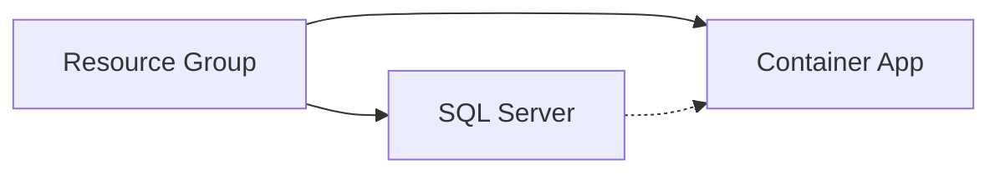

# Demonstration of app environment

<div class="opacity-80 italic mb-4">
Using pulumi to manage cloud environment
</div>

---
layout: center
hideInToc: true
---

# Basic Infrastructure Implementation
Building blocks of our demo environment

<div class="flex justify-center gap-12">
  <div v-click class="resource-group">
    <div class="text-4xl mb-2">🏢</div>
    <div class="text-xl">Resource Group</div>
    <div class="text-sm opacity-75">Logical container</div>
  </div>

  <div v-click class="resource-group">
    <div class="text-4xl mb-2">💾</div>
    <div class="text-xl">SQL Sever and Database</div>
    <div class="text-sm opacity-75">Data storage</div>
  </div>

  <div v-click class="resource-group">
    <div class="text-4xl mb-2">🎯</div>
    <div class="text-xl">Container App and Environment</div>
    <div class="text-sm opacity-75">Application runtime</div>
  </div>
</div>

<div v-click class="mt-12 text-center">
  <div class="text-sm opacity-75">Dependencies flow</div>

</div>

<style>
.resource-group {
  @apply text-center p-4 rounded bg-gray-100 bg-opacity-10;
}
</style>

<!--
# Presenter Notes
- Have Azure Portal open
- Rider ready
- Terminal with Azure CLI logged in
- Check Pulumi login status

## Demo Goals

- Show real infrastructure code
- Demonstrate resource dependencies
- Handle secrets properly
- Manage configuration
- Deploy to Azure
-->

---
hideInToc: true
---

# Starting the project
Reference for live demo...

<v-clicks>

1. Configuration
   ```csharp
    var config = new Config();
    var adminUsername = config.Require("sqlAdminUsername");
    var adminPassword = config.RequireSecret("sqlAdminPassword");
   ```

2. Resource Group
   ```csharp
    var resourceGroup = AzureResourceGroup.Create($"mews-pulumi-example-{location.Abbreviation}-tmp", location);
   ```

2. SQL Server
   ```csharp
   var sqlServer = new Server("demo-sql", new ServerArgs
   {
       ResourceGroupName = resourceGroup.Name,
       AdministratorLogin = "adminUser"
   });
   ```

</v-clicks>

<!--
# Speaker Notes

Setup:
- Begin with configuration
- Secure sensitive data
- Basic structure

Key Points:
- Config management
- Resource organization
- Name conventions

Questions/Engagement:
- "How do you handle secrets?"
- "What else needs config?"

Next:
- Add core resources
-->

---
hideInToc: true
---

# Adding long lived resources
Reference for live demo...

<v-clicks>

1. Container app environment
   ```csharp
    var containerAppEnvironment = AzureContainerAppEnvironment.Create(
        name: $"pulumi-example-cae--{location.Abbreviation}",
        location: location,
        resourceGroup: resourceGroup,
        logDestination: new AzureMonitorDestination()
    );
   ```

2. SQL Server
   ```csharp
    var sqlServer = AzureSqlServer.Create(
        name: $"pulumi-example-sqlserver-{location.Abbreviation}",
        resourceGroup: resourceGroup,
        location: location,
        adminLogin: adminUsername,
        adminPassword: adminPassword,
        protectFromDeletion: false
    );
   ```

</v-clicks>

<!--
# Speaker Notes

Setup:
- Building core infrastructure
- Production considerations
- Resource relationships

Key Points:
- Environment setup
- Database configuration
- Security settings

Questions/Engagement:
- "Which settings are critical?"
- "What would you change?"

Next:
- Complete the setup
-->

---
hideInToc: true
---

# Adding the database
Reference for live demo...

<v-clicks>

## SQL Database
   ```csharp
    var database = AzureSqlDatabase.Create(
        resourceName: $"pulumi-example-database-{location.Abbreviation}",
        databaseName: $"example-app-database",
        resourceGroup: resourceGroup,
        location: location,
        server: sqlServer,
        tier: new StandardDbS2(50),
        readScaleOut: DatabaseReadScale.Disabled,
        zoneRedundant: false,
        highAvailabilityReplicaCount: 0,
        BackupStorageRedundancy.Local
    );
   ```
</v-clicks>

<!--
# Speaker Notes

Setup:
- Database tier decisions
- Performance settings
- Availability options

Key Points:
- SKU selection impacts cost
- Redundancy choices
- Scaling capabilities

Questions/Engagement:
- "Which settings for dev vs prod?"
- "How do you size databases?"

Next:
- Add application layer
-->

---
hideInToc: true
---

# Adding the app
Reference for live demo...

<v-clicks>

## Container app
  ```csharp
    var app = AzureContainerApp.Create(
        name: $"pulumi-example-app-{location.Abbreviation}",
        resourceGroup: resourceGroup,
        location: location,
        containerName: "test-app",
        containerAppEnvironment: containerAppEnvironment,
        fullImageName: $"",
        containerResources: AzureContainerApp.GetResources(0.5, 2),
        minReplicas: 1,
        maxReplicas: 2,
        environmentVariables: null,
        secrets: null,
        dependsOn: database
    );
  ```
</v-clicks>

<!--
# Speaker Notes

Setup:
- Application deployment
- Resource allocation
- Scaling configuration

Key Points:
- Container resources
- Scaling rules
- Dependencies

Questions/Engagement:
- "How do you size containers?"
- "What triggers scaling?"

Next:
- Review all changes
-->

---
hideInToc: true
---

# Exploring the changes
Reference for live demo...

<v-clicks>

1. Show Preview
   ```bash
   pulumi preview
   ```

2. Check Generated Preview
   - Resource creation order
   - Property settings
   - Dependencies

</v-clicks>

<!--
# Speaker Notes

Setup:
- Preview before deployment
- Check all changes
- Understand dependencies

Key Points:
- Creation order
- Resource relationships
- Configuration validation

Questions/Engagement:
- "What would you verify?"
- "See any concerns?"

Next:
- Deploy changes
-->

---
hideInToc: true
---

# Live Deployment
Reference for live demo...

## Deployment Steps
<v-clicks>

1. Final Code Review
2. Preview Changes
3. Execute Deployment
4. Verify Resources

</v-clicks>

<!--
# Speaker Notes

Setup:
- Final checks
- Deployment process
- Verification steps

Key Points:
- Review changes first
- Monitor deployment
- Verify resources

Questions/Engagement:
- "What could go wrong?"
- "How to validate success?"

Next:
- Make some changes
-->

---
hideInToc: true
---

# Making Changes
Reference for live demo...

## Example Modifications
<v-clicks>

1. Change the resource requests for the container app
2. Open a PR
3. Preview changes
4. Deploy Changes

</v-clicks>

## Key Observations
<v-clicks>

- Change Detection
- State Management
- Dependency Updates
- Resource Protection

</v-clicks>

<!--
# Speaker Notes

Setup:
- Common change scenario
- Preview impact
- Update process

Key Points:
- Change detection
- State updates
- Resource protection

Questions/Engagement:
- "Which changes are risky?"
- "How to test changes?"

Next:
- Understanding limitations
-->