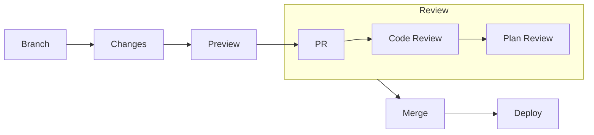

# Benefits and drawbacks

Key takeaways from demo 

---
layout: two-cols-header
hideInToc: true
---

# Preview Limitations
Understanding what preview can and cannot catch

::left::

  
✅ What Preview Shows

  <ul class="text-sm">
    <li>Resource additions/removals</li>
    <li>Property changes</li>
    <li>Basic validation</li>
    <li>Dependencies</li>
  </ul>

::right::

  
⚠️ What Preview Misses

  <ul class="text-sm">
    <li>API-specific rules</li>
    <li>Some validation rules</li>
    <li>Runtime conditions</li>
    <li>External dependencies</li>
  </ul>

  
Best Practice

  

    Always test changes in development environment first
  

<!--
# Speaker Notes

Setup:
- Preview is powerful but limited
- Understanding boundaries
- Real-world experience

Key Points:
- Shows structural changes
- Misses runtime validation
- Test in dev first

Questions/Engagement:
- "Where might preview fail?"
- "How to handle limitations?"

Next:
- Team processes
-->

---
layout: center
hideInToc: true
---

# Team Workflow
Collaborative infrastructure management

  

    
👥 Review Points

    <ul class="text-sm">
      <li>Code quality</li>
      <li>Security checks</li>
      <li>Cost impact</li>
      <li>Best practices</li>
    </ul>
  

  

    
🔍 Validation

    <ul class="text-sm">
      <li>Automated tests</li>
      <li>Policy checks</li>
      <li>Preview results</li>
      <li>Change scope</li>
    </ul>
  

<!--
# Speaker Notes

Setup:
- Standard PR process
- Multiple checkpoints
- Team collaboration

Key Points:
- Code review first
- Plan verification
- Automated checks

Questions/Engagement:
- "Similar to your workflow?"
- "What would you check?"

Next:
- Benefits and challenges
-->

---
layout: two-cols-header
hideInToc: true
---

# Benefits & Challenges
Making the transition to Infrastructure as Code

::left::

  

    
🎯 Benefits

    <ul class="text-sm">
      <li>Version Control</li>
      <li>Familiar Dev Experience</li>
      <li>Repeatability</li>
      <li>Self-Documenting</li>
      <li>Team Collaboration</li>
    </ul>
  

::right::

  

    
💪 Challenges

    <ul class="text-sm">
      <li>Learning Curve</li>
      <li>Initial Setup</li>
      <li>Team Adoption</li>
      <li>State Management</li>
      <li>Integration of existing resources</li>
    </ul>
  

<!--
# Speaker Notes

Start with benefits:
- Each one connects to their dev experience
- Give quick examples for each
- Point out long-term gains

Then challenges:
- Be honest about difficulties
- Not appripriate at every scale
- But show they're manageable
- Most are one-time costs
- Common to all new tech adoption

Key message:
"Benefits compound over time, challenges decrease"

Ask:
"Which benefit interests you most?"
"Which challenge concerns you?"
-->

<!--
# Speaker Notes

Setup:
- Realistic assessment
- Both sides matter
- Trade-offs exist

Key Points:
- Benefits compound
- Challenges decrease
- Team impact

Challenges:
- Talk about difficulties
- Not appripriate at every scale
- Most are one-time costs
- Common to all new tech adoption

Questions/Engagement:
- "Which benefit matters most?"
- "Which challenge concerns you?"

Next:
- Language advantages
-->

---
layout: two-cols-header
hideInToc: true
---

# Language Benefits
Using C# for Infrastructure Management

::left::

  

    
🛠️ Development Features

    <ul class="text-sm">
      <li>Strong Type System</li>
      <li>IDE Support</li>
      <li>Refactoring Tools</li>
      <li>Package Ecosystem</li>
      <li>Testing Framework?</li>
    </ul>
  

::right::

  

    
📚 Code Organization

    <ul class="text-sm">
      <li>Classes and Inheritance</li>
      <li>Error Handling</li>
      <li>Documentation Comments</li>
      <li>Code Sharing</li>
      <li>Team Collaboration</li>
    </ul>
  

<!--
# Speaker Notes

Setup:
- C# advantages
- Developer experience
- Team productivity

Key Points:
- Strong typing helps
- IDE support
- Code organization

Questions/Engagement:
- "Using these features now?"
- "Which help most?"

Next:
- Platform building
-->