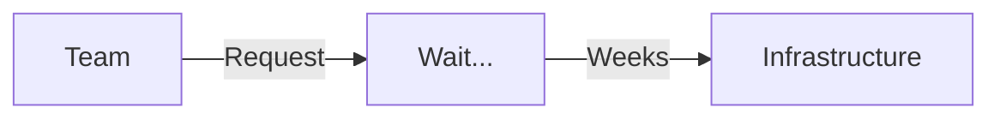
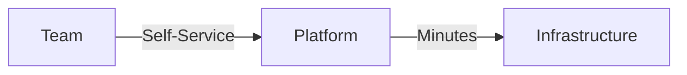
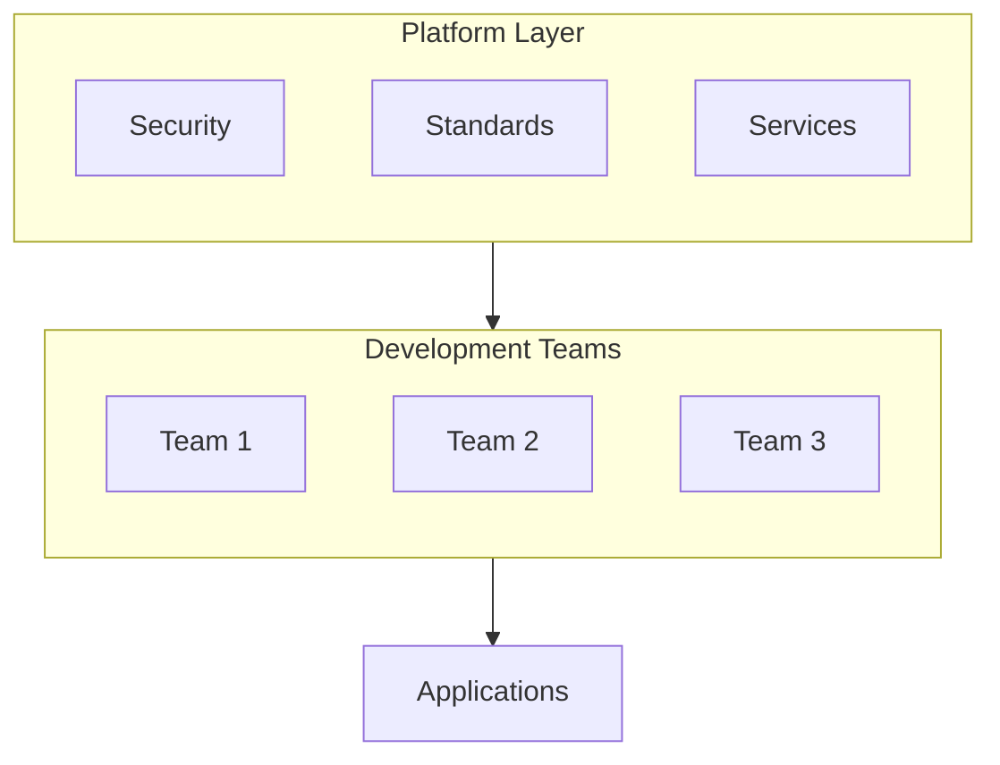
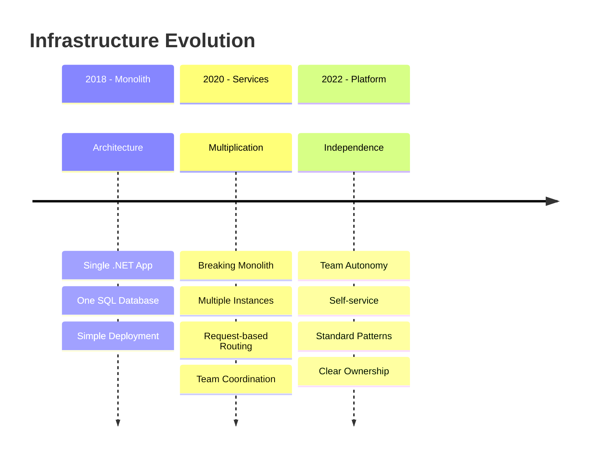

# Internal platforms

<div class="opacity-80 italic mb-4">
Build reusable patterns at scale
</div>

<!--
# Speaker Notes

Setup:
- Platform builds on our IaC knowledge
- Enterprise-scale challenges
- Beyond individual resources

Key Points:
- Moving from tools to platform
- Standardizing practices
- Team enablement

Questions/Engagement:
- "What's your experience with platforms?"

Next:
- Look at infrastructure delivery
-->

---
layout: center
hideInToc: true
---

# Infrastructure Delivery Evolution
From weeks to minutes, from process to platform

## Traditional Approach


## Platform Approach


<!--
# Speaker Notes

Key Points to Cover:

1. Traditional Process (Top diagram)
   - Teams submitting tickets
   - Manual review/approval cycles
   - Weeks of waiting time
   - Low visibility into progress
   - High process overhead
   - Impact on team velocity (rules of flow)

2. Platform Evolution (Bottom diagram)
   - Self-service capabilities
   - Automated validation
   - Minutes vs weeks
   - Clear feedback loops
   - Built-in standards
   - Team empowerment

3. Key Benefits
   - Speed of delivery
   - Team autonomy
   - Standardization
   - Predictable outcomes
   - Better developer experience

Questions to Drive Engagement:
- "What problems do you see in the traditional approach?"
- "How would immediate access change your development workflow?"
- "Where might human review still be valuable?"

Real World Connection:
- Share Mews journey between these models
- Reference familiar tools (GitHub, Azure Portal)
- Connect to their project experiences
- Discuss modern DevOps practices
-->

---
layout: two-cols-header
hideInToc: true
---

# Key Challenges
Understanding common scaling issues

::left::

<div class="space-y-4">
  <div v-click class="challenge-box">
    <div class="text-xl mb-2">🕒 Speed & Scale</div>
    <ul class="text-sm">
      <li>Teams waiting weeks</li>
      <li>Manual bottlenecks</li>
      <li>Limited resources</li>
    </ul>
  </div>
  
  <div v-click class="challenge-box">
    <div class="text-xl mb-2">🔄 Consistency</div>
    <ul class="text-sm">
      <li>Environment drift</li>
      <li>Configuration variance</li>
      <li>Undocumented changes</li>
    </ul>
  </div>
</div>

::right::

<div class="space-y-4">
  <div v-click class="challenge-box">
    <div class="text-xl mb-2">🔒 Security & Control</div>
    <ul class="text-sm">
      <li>Review bottlenecks</li>
      <li>Access management</li>
      <li>Compliance needs</li>
    </ul>
  </div>
  
  <div v-click class="challenge-box">
    <div class="text-xl mb-2">👥 Team Impact</div>
    <ul class="text-sm">
      <li>Delayed projects</li>
      <li>Reduced productivity</li>
      <li>Team frustration</li>
    </ul>
  </div>
</div>

<style>
.challenge-box {
  @apply p-4 rounded bg-orange-500 bg-opacity-10;
}
</style>

<!--
# Speaker Notes

Key Points to Cover:
1. Speed & Scale
   - Impact on delivery timelines
   - Resource constraints
   - Manual process bottlenecks

2. Consistency Issues
   - Configuration drift between environments
   - Undocumented manual changes
   - Troubleshooting difficulties

3. Security & Control
   - Balance between speed and safety
   - Access management overhead
   - Compliance requirements

4. Human Impact
   - Team productivity loss
   - Project delays
   - Developer satisfaction
   - Context switching costs

Engagement Strategy:
- Ask for their experiences with each challenge
- Get examples from their projects
- Discuss which problems resonate most

Real World Connection:
- Share Mews examples for each category
- Connect to their course project challenges
- Discuss typical startup vs enterprise needs

Questions to Ask:
- "Which of these challenges have you faced?"
- "How do these impact your development process?"
- "Which would you prioritize solving?"
-->

---
layout: two-cols-header
hideInToc: true
---

# Internal Developer Platform
Building blocks for team empowerment

::left::



::right::


<div class="grid grid-cols-3 gap-8 mt-8">
  <div v-click class="platform-box">
    <div class="text-xl mb-2">🔒 Security</div>
    <div class="text-sm">Built-in compliance and access controls</div>
  </div>

  <div v-click class="platform-box">
    <div class="text-xl mb-2">📋 Standards</div>
    <div class="text-sm">Best practices and guardrails</div>
  </div>

  <div v-click class="platform-box">
    <div class="text-xl mb-2">🔧 Services</div>
    <div class="text-sm">Shared components and tools</div>
  </div>
</div>

<style>
.platform-box {
  @apply p-4 rounded bg-blue-500 bg-opacity-10 text-center;
}
</style>

<!--
# Speaker Notes

Setup (1 min):
- "Let's see how a platform solves those challenges..."
- Reference back to previous problems

Key Components (2-3 mins):

1. Platform Layer
   - Central coordination point
   - Automated workflows
   - Policy enforcement
   - Resource management

2. Core Platform Features
   - Security: Built-in compliance, access controls
   - Standards: Best practices, patterns, guardrails
   - Services: Shared components, common tools

3. Team Benefits
   - Self-service access
   - Clear boundaries
   - Automated processes
   - Focus on development

4. Real Examples from Mews:
   - Database provisioning
   - Environment creation
   - Access management
   - Configuration standards

Questions to Ask:
- "What would you want from a platform?"
- "Which features would help your projects most?"
- "Where would you start building one?"

Connect to Their Experience:
- Compare to tools they know (GitHub, Azure)
- Reference course project needs
- Discuss startup vs enterprise needs

Transition:
- Lead into how we built this at Mews...
-->

---
layout: two-cols-header
hideInToc: true
---

# Platform Benefits
Empowering teams while maintaining control

::left::

<div class="space-y-4">
  <div v-click class="benefit-box">
    <div class="text-xl mb-2">👩‍💻 For Development Teams</div>
    <ul class="text-sm">
      <li>Self-service infrastructure</li>
      <li>Quick provisioning</li>
      <li>Standard patterns</li>
      <li>Clear documentation</li>
      <li>Focus on code</li>
    </ul>
  </div>
</div>

::right::

<div class="space-y-4">
  <div v-click class="benefit-box">
    <div class="text-xl mb-2">🏗️ For Platform Teams</div>
    <ul class="text-sm">
      <li>Controlled scaling</li>
      <li>Security enforcement</li>
      <li>Resource optimization</li>
      <li>Easier maintenance</li>
      <li>Happy developers</li>
    </ul>
  </div>
</div>

<style>
.benefit-box {
  @apply p-4 rounded bg-green-500 bg-opacity-10;
}
</style>

<!--
# Speaker Notes

Setup (1 min):
- "A well-designed platform helps both sides..."

Development Team Benefits (2 mins):

1. Self-Service
   - No waiting for approvals
   - Clear service catalog
   - Automated provisioning
   - Immediate access

2. Developer Experience
   - Familiar tools and patterns
   - Built-in best practices
   - Clear documentation
   - Streamlined workflows

Platform Team Benefits (2 mins):

1. Control & Oversight
   - Policy enforcement
   - Resource management
   - Cost control
   - Security compliance

2. Operational Efficiency
   - Automated management
   - Standard patterns
   - Reduced support load
   - Better visibility

Real Examples:
- Share Mews team experiences
- Show productivity improvements
- Discuss team satisfaction
- Highlight key metrics

Questions to Ask:
- "Which benefits resonate most?"
- "What would you add to this list?"
- "How would this change your workflow?"

Next Steps:
- Transition to how we implement this...
-->

---
layout: center
hideInToc: true
---

# The Mews Journey



<!--
# Speaker Notes

Setup (1 min):
- "Let me show you our infrastructure evolution..."
- Connect to common growth patterns

Journey Phases (4-5 mins):

1. Monolith Phase
   - Simple but effective initially
   - One team, one codebase
   - Fast deployment, but...
   - All changes affect everyone
   - Limited team scaling

2. Service Multiplication
   - Teams growing rapidly
   - Need for independence
   - Breaking apart monolith
   - New challenges emerged:
     * Deployment coordination
     * Configuration management
     * Environment consistency
     * Team dependencies
     * "You build it, you run it" mindset

3. Platform Solution
   - Team independence achieved
   - Clear ownership boundaries
   - Standardized practices
   - Self-service infrastructure
   - Faster innovation cycle

Real Impact Examples:
- Deployment time changes
- Team onboarding speed
- Innovation velocity
- Development satisfaction

Questions to Drive Engagement:
- "Where are your projects on this journey?"
- "What signs show you need to evolve?"
- "How would you handle this transition?"

Connect to Their Experience:
- Reference course project complexity
- Discuss startup evolution patterns
- Show industry parallels
-->

---
layout: two-cols-header
hideInToc: true
---

# Before and After
Transformation of infrastructure management

::left::

<div v-click class="phase-box red-tint">
  <div class="text-xl mb-2">⚡ Monolith Era</div>
  <ul class="text-sm">
    <li>Single deployment unit</li>
    <li>All changes affect everyone</li>
    <li>One database for all</li>
    <li>Central management</li>
    <li>Limited team autonomy</li>
  </ul>
</div>

::right::

<div v-click class="phase-box green-tint">
  <div class="text-xl mb-2">🚀 Service Era</div>
  <ul class="text-sm">
    <li>Independent services</li>
    <li>Isolated changes</li>
    <li>Team-owned databases</li>
    <li>Self-service platform</li>
    <li>Continuous deployment</li>
    <li>"You build it, you run it"</li>
  </ul>
</div>

<style>
.phase-box {
  @apply p-4 rounded;
}
.red-tint {
  @apply bg-red-500 bg-opacity-10;
}
.green-tint {
  @apply bg-green-500 bg-opacity-10;
}
</style>

<!--
# Speaker Notes

Setup:
- "Let's see what actually changed day-to-day..."

Evolution Impact:

1. Technical Changes
   - From single app to many services
   - From shared DB to dedicated databases
   - From manual to automated deployment
   - From central to distributed control

2. Team Changes
   - From waiting to self-service
   - From coordination to autonomy
   - From bottlenecks to flow
   - From restriction to enablement

3. Culture Shift
   - Service ownership mentality
   - End-to-end responsibility
   - Empowered teams
   - Innovation freedom

Real Examples:
- Database provisioning: weeks → minutes
- Deployment frequency: days → hours
- Team onboarding: months → weeks
- Configuration changes: tickets → self-service

Questions to Ask:
- "Which changes resonate most?"
- "What challenges do you see in this transition?"
- "How would you manage this evolution?"

Transition to Platform:
- Lead into how we enabled this transformation...
-->

---
layout: center
hideInToc: true
---

# Why Platforms Work
Key principles of successful infrastructure platforms

<div class="grid grid-cols-3 gap-8 mt-8">
  <div v-click class="principle-box">
    <div class="text-xl mb-2">📋 Standards</div>
    <ul class="text-sm">
      <li>Clear best practices</li>
      <li>Built-in guardrails</li>
      <li>Common patterns</li>
    </ul>
  </div>

  <div v-click class="principle-box">
    <div class="text-xl mb-2">🤖 Automation</div>
    <ul class="text-sm">
      <li>Repeatable processes</li>
      <li>Consistent results</li>
      <li>Fast delivery</li>
    </ul>
  </div>

  <div v-click class="principle-box">
    <div class="text-xl mb-2">🔑 Self-Service</div>
    <ul class="text-sm">
      <li>Team independence</li>
      <li>Quick access</li>
      <li>Built-in compliance</li>
    </ul>
  </div>
</div>

<style>
.principle-box {
  @apply p-4 rounded bg-blue-500 bg-opacity-10;
}
</style>

<!--
# Speaker Notes

Setup:
- "Here's why this approach succeeded..."

Key Success Factors:

1. Standards
   - Clear best practices
   - Built-in guardrails
   - Common patterns
   - Shared knowledge

2. Automation
   - Repeatable processes
   - Consistent results
   - Fast delivery
   - Error reduction

3. Self-Service
   - Team independence
   - Quick access
   - Clear options
   - Built-in compliance

4. Results
   - Faster delivery
   - Happy teams
   - Better quality
   - Sustainable growth

Real Examples:
- Database provisioning time
- Environment creation
- Access management
- Configuration standards

Questions to Ask:
- "Which factor seems most important?"
- "What would you add to this?"
- "How would you measure success?"

Lead Into Next Section:
- Transition to how we built this...
-->
---
layout: center
hideInToc: true
---

# Evolution of Our Infrastructure SDK
Building abstractions for developer experience

<div class="grid grid-cols-3 gap-8 mt-8">
  <div v-click class="sdk-box">
    <div class="text-xl mb-2">Raw Pulumi</div>
    <div class="text-sm">
      <div class="mb-2 font-bold">Characteristics</div>
      <ul>
        <li>Direct resource creation</li>
        <li>Full flexibility</li>
        <li>Complex configuration</li>
      </ul>
    </div>
  </div>

  <div v-click class="sdk-box">
    <div class="text-xl mb-2">Low-Level SDK</div>
    <div class="text-sm">
      <div class="mb-2 font-bold">Improvements</div>
      <ul>
        <li>Better defaults</li>
        <li>Type safety</li>
        <li>Basic patterns</li>
      </ul>
    </div>
  </div>

  <div v-click class="sdk-box">
    <div class="text-xl mb-2">High-Level SDK</div>
    <div class="text-sm">
      <div class="mb-2 font-bold">Benefits</div>
      <ul>
        <li>Best practices built-in</li>
        <li>Common scenarios</li>
        <li>Team standards</li>
      </ul>
    </div>
  </div>
</div>

<style>
.sdk-box {
  @apply p-4 rounded bg-blue-500 bg-opacity-10;
}
</style>

<!--
# Speaker Notes

Setup:
- "Let's look at how our SDK evolved..."
- Show how abstraction layers developed

Key Evolution Points:
1. Started with raw Pulumi
2. Created low-level wrappers
3. Built high-level patterns

Real Progression:
- Response to team needs
- Learning from usage
- Balancing flexibility and simplicity
-->

---
layout: two-cols-header
hideInToc: true
---

# The Evolution Steps
From raw resources to developer experience

::left::

## Raw Pulumi
```csharp
// Direct Azure resource creation
var database = new Database(
    name: resourceName,
    args: new DatabaseArgs
    {
        ResourceGroupName = resourceGroup.Name,
        ServerName = server.Name,
        Location = location.Id,
        Sku = new SkuArgs
        {
            Name = "Standard",
            Tier = "Standard",
            Capacity = db.Dtu
        }
    },
    options: new CustomResourceOptions
    {
        Protect = protectFromDeletion
    }
);
```

::right::

## Low-Level SDK
```csharp
// Wrapped with better defaults
var database = AzureSqlDatabase.Create(
    resourceName: resourceName,
    databaseName: databaseName,
    resourceGroup: resourceGroup,
    location: location,
    server: server,
    tier: new StandardDb(50),
    readScaleOut: DatabaseReadScale.Enabled,
    zoneRedundant: true,
    protectFromDeletion: true
);
```

<!--
# Speaker Notes

Setup:
- "Let's see real examples from our codebase..."

Evolution Steps:
1. Raw Pulumi
   - Direct resource creation
   - All options explicit
   - Complex configuration
   - Error-prone

2. Low-Level SDK
   - Better parameter organization
   - Sensible defaults
   - Type safety
   - Still infrastructure-focused

Key Improvements:
- Reduced complexity
- Better error handling
- Standardized options
- Clearer intentions

Show in IDE:
- Parameter completion
- Type checking
- Documentation
-->

---
layout: center
hideInToc: true
---

# High-Level SDK Today

```csharp
// From real Mews Infrastructure.cs
var database = builder.AddSqlDatabase(new SqlDatabaseArgs(
    Server: new SqlServerArgs(
        Location: location,
        AdminLogin: builder.GetString("sql-server-admin-login"),
        AdminPassword: new OutputValueSource(builder.GetSecret("sql-server-admin-password"))
    ),
    Name: "main",
    Tier: new Hyperscale(CpuCount: 2),
    ZoneRedundancy: false,
    HighAvailabilityReplicaCount: 0,
    BackupStorageRedundancy: BackupStorageRedundancy.Local,
    GeoReplicaInPairedRegion: false
));

// Inject configurations into container app
app.InjectKeyVaultURI(keyVault);
app.InjectSqlConnectionStrings(database);
app.InjectAppConfigurationEndpoint(appConfiguration);
app.InjectRedisConnectionInfo(cache, new RedisOptions());
```

<!--
# Speaker Notes

Setup:
- "This is our current approach..."

Key Features:
1. Builder Pattern
   - Fluent interface
   - Clear configuration
   - Secret management
   - Resource relationships

2. High-Level Operations
   - Configuration injection
   - Standard patterns
   - Security best practices
   - Clear dependencies

3. Developer Benefits
   - Infrastructure as code
   - Clear intentions
   - Standard patterns
   - Safety and validation

Real Impact:
- Faster team onboarding
- Fewer configuration errors
- Better security practices
- Clear audit trail

Questions to Ask:
- "How does this compare to your infrastructure code?"
- "What patterns do you see?"
- "Where could this help in your projects?"
-->

---
layout: two-cols-header
hideInToc: true
---

# Key Design Principles
Building effective infrastructure abstractions

::left::

<div v-click class="principle-box">
  <div class="text-xl mb-2">🎯 Core Principles</div>
  <ul class="text-sm">
    <li>Make complexity manageable</li>
    <li>Standard patterns by default</li>
    <li>Team autonomy with guardrails</li>
    <li>Balance abstraction and control</li>
    <li>Built-in best practices</li>
    <li>Clear defaults with overrides</li>
  </ul>
</div>

::right::

<div v-click class="principle-box">
  <div class="text-xl mb-2">💻 Developer Experience</div>
  <ul class="text-sm">
    <li>Familiar C# patterns</li>
    <li>Strong type safety</li>
    <li>IDE support (completion, docs)</li>
    <li>Validation rules embedded</li>
    <li>Fast feedback loops</li>
    <li>Self-service deployment</li>
  </ul>
</div>

<style>
.principle-box {
  @apply p-4 rounded bg-blue-500 bg-opacity-10;
}
</style>


<!--
# Speaker Notes

Setup:
- "These principles guide our SDK development..."
- Connect back to previous challenges

Key Areas to Cover:

1. Core Principles
   - Don't hide complexity, make it manageable
   - Provide clear patterns that teams can follow
   - Enable autonomy while maintaining standards
   - Always have escape hatches for edge cases
   - Real Example: Database provisioning patterns

2. Developer Experience
   - Leverage C# features teams already know
   - Use type system to prevent errors
   - Enable IDE features developers rely on
   - Make errors clear and actionable
   - Real Example: IntelliSense for resource configurations

3. Implementation Focus
   - Sensible defaults that work for 80% of cases
   - Security and compliance built into patterns
   - Cost awareness in resource configurations
   - Clear relationships between resources
   - Real Example: Standard naming conventions

4. Team Enablement
   - Teams can deploy without platform help
   - Clear ownership of resources
   - Easy configuration management
   - Common patterns reduce cognitive load
   - Real Example: Configuration injection patterns

Questions to Drive Engagement:
- "Which principles resonate most with your experience?"
- "What patterns do you use in your projects?"
- "How do you balance standards vs flexibility?"
- "What would you add to these principles?"

Real World Connection:
- Connect to their course projects
- Reference common development patterns
- Show how principles scale with team size

Transition to Next Topic:
- Lead into how we implemented these principles
- Show real code examples
- Demonstrate principles in action
-->

---
layout: two-cols-header
hideInToc: true
---

# Current Challenges
Ongoing areas of improvement and focus

::left::

<div v-click class="challenge-box">
  <div class="text-xl mb-2">🔧 Technical Challenges</div>
  
  <div class="mt-4">
    <div class="mb-2 font-bold text-sm">Abstraction Balance</div>
    <div class="text-sm opacity-75">Finding the right level between flexibility and simplicity</div>
  </div>
  
  <div class="mt-4">
    <div class="mb-2 font-bold text-sm">Backwards Compatibility</div>
    <div class="text-sm opacity-75">Managing SDK evolution without breaking changes</div>
  </div>
  
  <div class="mt-4">
    <div class="mb-2 font-bold text-sm">Testing Infrastructure</div>
    <div class="text-sm opacity-75">Effective testing strategies for infrastructure code</div>
  </div>
</div>

::right::

<div v-click class="challenge-box">
  <div class="text-xl mb-2">👥 Team Challenges</div>
  
  <div class="mt-4">
    <div class="mb-2 font-bold text-sm">Adoption & Training</div>
    <div class="text-sm opacity-75">Getting teams comfortable with infrastructure as code</div>
  </div>
  
  <div class="mt-4">
    <div class="mb-2 font-bold text-sm">Documentation</div>
    <div class="text-sm opacity-75">Maintaining clear, up-to-date documentation</div>
  </div>
  
  <div class="mt-4">
    <div class="mb-2 font-bold text-sm">Speed of delivery</div>
    <div class="text-sm opacity-75">The development of the SDK can be slow</div>
  </div>
</div>

<style>
.challenge-box {
  @apply p-4 rounded bg-orange-500 bg-opacity-10;
}
</style>

<!--
# Presenter Notes
- Share real challenges
- Discuss solutions found
- Show ongoing work
- Ask for their thoughts
-->
