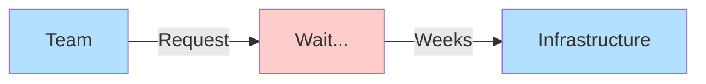
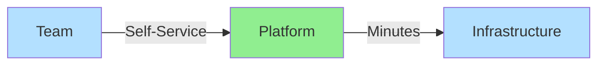
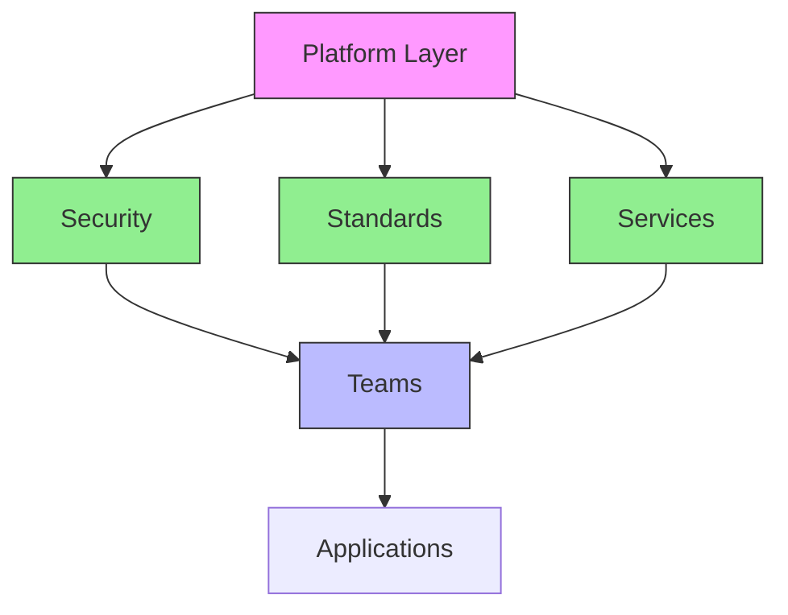
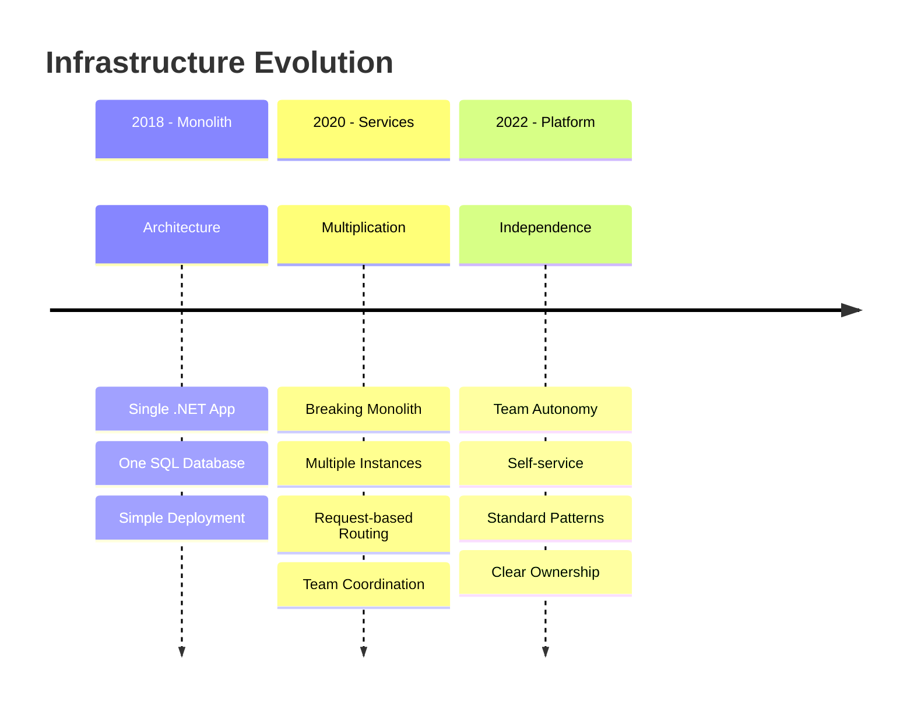
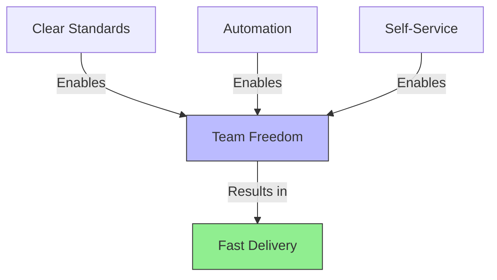
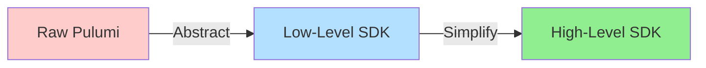

# Infrastructure Delivery Evolution
From weeks to minutes, from process to platform

::left::

## Traditional Approach


::right::

## Platform Approach


<!--
# Speaker Notes

Setup (2-3 mins):
- Start by asking: "How long do you usually wait for infrastructure access?"
- Use their answers to frame the problem

Key Points to Cover:

1. Traditional Process (Left diagram)
   - Teams submitting tickets
   - Manual review/approval cycles
   - Weeks of waiting time
   - No visibility into progress
   - High process overhead
   - Impact on team velocity

2. Platform Evolution (Right diagram)
   - Self-service capabilities
   - Automated validation
   - Minutes vs weeks
   - Clear feedback loops
   - Built-in standards
   - Team empowerment

3. Key Benefits
   - Speed of delivery
   - Team autonomy
   - Standardization
   - Predictable outcomes
   - Better developer experience

Questions to Drive Engagement:
- "What problems do you see in the traditional approach?"
- "How would immediate access change your development workflow?"
- "Where might human review still be valuable?"

Real World Connection:
- Share Mews journey between these models
- Reference familiar tools (GitHub, Azure Portal)
- Connect to their project experiences
- Discuss modern DevOps practices

Transition to Next Slides:
- "These benefits sound great, but achieving them brings its own challenges..."
-->

---
layout: two-cols-header
---

# Key Platform Challenges

::left::

<div class="space-y-4">
  <div v-click class="challenge-box">
    <div class="text-xl mb-2">🕒 Speed & Scale</div>
    <ul class="ml-4">
      <li>Teams waiting weeks</li>
      <li>Manual bottlenecks</li>
      <li>Limited resources</li>
    </ul>
  </div>
  
  <div v-click class="challenge-box">
    <div class="text-xl mb-2">🔄 Consistency</div>
    <ul class="ml-4">
      <li>Environment drift</li>
      <li>Configuration variance</li>
      <li>Undocumented changes</li>
    </ul>
  </div>
</div>

::right::

<div class="space-y-4">
  <div v-click class="challenge-box">
    <div class="text-xl mb-2">🔒 Security & Control</div>
    <ul class="ml-4">
      <li>Review bottlenecks</li>
      <li>Access management</li>
      <li>Compliance needs</li>
    </ul>
  </div>
  
  <div v-click class="challenge-box">
    <div class="text-xl mb-2">👥 Team Impact</div>
    <ul class="ml-4">
      <li>Delayed projects</li>
      <li>Reduced productivity</li>
      <li>Team frustration</li>
    </ul>
  </div>
</div>

<style>
.challenge-box {
  @apply p-4 rounded bg-gray-100 bg-opacity-10;
}
</style>

<!--
# Speaker Notes

Setup (1-2 mins):
- "These challenges affect organizations of all sizes..."

Key Points to Cover:
1. Speed & Scale
   - Impact on delivery timelines
   - Resource constraints
   - Manual process bottlenecks

2. Consistency Issues
   - Configuration drift between environments
   - Undocumented manual changes
   - Troubleshooting difficulties

3. Security & Control
   - Balance between speed and safety
   - Access management overhead
   - Compliance requirements

4. Human Impact
   - Team productivity loss
   - Project delays
   - Developer satisfaction
   - Context switching costs

Engagement Strategy:
- Ask for their experiences with each challenge
- Get examples from their projects
- Discuss which problems resonate most

Real World Connection:
- Share Mews examples for each category
- Connect to their course project challenges
- Discuss typical startup vs enterprise needs

Questions to Ask:
- "Which of these challenges have you faced?"
- "How do these impact your development process?"
- "Which would you prioritize solving?"
-->
---
layout: center
---

# Internal Developer Platform



<!--
# Speaker Notes

Setup (1 min):
- "Let's see how a platform solves those challenges..."
- Reference back to previous problems

Key Components (2-3 mins):

1. Platform Layer
   - Central coordination point
   - Automated workflows
   - Policy enforcement
   - Resource management

2. Core Platform Features
   - Security: Built-in compliance, access controls
   - Standards: Best practices, patterns, guardrails
   - Services: Shared components, common tools

3. Team Benefits
   - Self-service access
   - Clear boundaries
   - Automated processes
   - Focus on development

4. Real Examples from Mews:
   - Database provisioning
   - Environment creation
   - Access management
   - Configuration standards

Questions to Ask:
- "What would you want from a platform?"
- "Which features would help your projects most?"
- "Where would you start building one?"

Connect to Their Experience:
- Compare to tools they know (GitHub, Azure)
- Reference course project needs
- Discuss startup vs enterprise needs

Transition:
- Lead into how we built this at Mews...
-->

---
layout: two-cols-header
---

# Platform Benefits

::left::

## For Development Teams

<div v-click>
<div class="benefits-box">

- Self-service infrastructure
- Quick provisioning
- Standard patterns
- Clear documentation
- Focus on code

</div>
</div>

::right::

## For Platform Teams

<div v-click>
<div class="benefits-box">

- Controlled scaling
- Security enforcement
- Resource optimization
- Easier maintenance
- Happy developers

</div>
</div>

<style>
.benefits-box {
  @apply p-4 rounded bg-gray-100 bg-opacity-10;
}
</style>

<!--
# Speaker Notes

Setup (1 min):
- "A well-designed platform helps both sides..."

Development Team Benefits (2 mins):

1. Self-Service
   - No waiting for approvals
   - Clear service catalog
   - Automated provisioning
   - Immediate access

2. Developer Experience
   - Familiar tools and patterns
   - Built-in best practices
   - Clear documentation
   - Streamlined workflows

Platform Team Benefits (2 mins):

1. Control & Oversight
   - Policy enforcement
   - Resource management
   - Cost control
   - Security compliance

2. Operational Efficiency
   - Automated management
   - Standard patterns
   - Reduced support load
   - Better visibility

Real Examples:
- Share Mews team experiences
- Show productivity improvements
- Discuss team satisfaction
- Highlight key metrics

Questions to Ask:
- "Which benefits resonate most?"
- "What would you add to this list?"
- "How would this change your workflow?"

Next Steps:
- Transition to how we implement this...
-->

---
layout: center
---

# The Mews Journey



<!--
# Speaker Notes

Setup (1 min):
- "Let me show you our infrastructure evolution..."
- Connect to common growth patterns

Journey Phases (4-5 mins):

1. Monolith Phase
   - Simple but effective initially
   - One team, one codebase
   - Fast deployment, but...
   - All changes affect everyone
   - Limited team scaling

2. Service Multiplication
   - Teams growing rapidly
   - Need for independence
   - Breaking apart monolith
   - New challenges emerged:
     * Deployment coordination
     * Configuration management
     * Environment consistency
     * Team dependencies
     * "You build it, you run it" mindset

3. Platform Solution
   - Team independence achieved
   - Clear ownership boundaries
   - Standardized practices
   - Self-service infrastructure
   - Faster innovation cycle

Real Impact Examples:
- Deployment time changes
- Team onboarding speed
- Innovation velocity
- Development satisfaction

Questions to Drive Engagement:
- "Where are your projects on this journey?"
- "What signs show you need to evolve?"
- "How would you handle this transition?"

Connect to Their Experience:
- Reference course project complexity
- Discuss startup evolution patterns
- Show industry parallels
-->

---
layout: two-cols-header
---

# Before and After

::left::

## Monolith Era

<div v-click class="phase-box">

- Single deployment unit
- All changes affect everyone
- One database for all
- Central management
- Deployment queues
- Limited team autonomy

</div>

::right::

## Service Era

<div v-click class="phase-box">

- Independent services
- Isolated changes
- Team-owned databases
- Self-service platform
- Continuous deployment
- "You build it, you run it"

</div>

<style>
.phase-box {
  @apply p-4 rounded bg-gray-100 bg-opacity-10;
}
</style>

<!--
# Speaker Notes

Setup (1 min):
- "Let's see what actually changed day-to-day..."

Evolution Impact (3-4 mins):

1. Technical Changes
   - From single app to many services
   - From shared DB to dedicated databases
   - From manual to automated deployment
   - From central to distributed control

2. Team Changes
   - From waiting to self-service
   - From coordination to autonomy
   - From bottlenecks to flow
   - From restriction to enablement

3. Culture Shift
   - Service ownership mentality
   - End-to-end responsibility
   - Empowered teams
   - Innovation freedom

Real Examples:
- Database provisioning: weeks → minutes
- Deployment frequency: days → hours
- Team onboarding: months → weeks
- Configuration changes: tickets → self-service

Questions to Ask:
- "Which changes resonate most?"
- "What challenges do you see in this transition?"
- "How would you manage this evolution?"

Transition to Platform:
- Lead into how we enabled this transformation...
-->

---
layout: center
---

# Why Platform Worked



<!--
# Speaker Notes

Setup (1 min):
- "Here's why this approach succeeded..."

Key Success Factors (3-4 mins):

1. Standards
   - Clear best practices
   - Built-in guardrails
   - Common patterns
   - Shared knowledge

2. Automation
   - Repeatable processes
   - Consistent results
   - Fast delivery
   - Error reduction

3. Self-Service
   - Team independence
   - Quick access
   - Clear options
   - Built-in compliance

4. Results
   - Faster delivery
   - Happy teams
   - Better quality
   - Sustainable growth

Real Examples:
- Database provisioning time
- Environment creation
- Access management
- Configuration standards

Questions to Ask:
- "Which factor seems most important?"
- "What would you add to this?"
- "How would you measure success?"

Lead Into Next Section:
- Transition to how we built this...
-->
---
layout: center
---

# Evolution of Our Infrastructure SDK

<div class="text-sm opacity-75 mb-4">From raw Pulumi to developer-friendly abstractions</div>



<!--
# Speaker Notes

Setup (1 min):
- "Let's look at how our SDK evolved..."
- Show how abstraction layers developed

Key Evolution Points:
1. Started with raw Pulumi
2. Created low-level wrappers
3. Built high-level patterns

Real Progression:
- Response to team needs
- Learning from usage
- Balancing flexibility and simplicity
-->

---
layout: two-cols-header
---

# The Evolution Steps
From raw resources to developer experience

::left::

## Raw Pulumi
```csharp
// Direct Azure resource creation
var database = new Database(
    name: resourceName,
    args: new DatabaseArgs
    {
        ResourceGroupName = resourceGroup.Name,
        ServerName = server.Name,
        Location = location.Id,
        Sku = new SkuArgs
        {
            Name = "Standard",
            Tier = "Standard",
            Capacity = db.Dtu
        }
    },
    options: new CustomResourceOptions
    {
        Protect = protectFromDeletion
    }
);
```

::right::

## Low-Level SDK
```csharp
// Wrapped with better defaults
var database = AzureSqlDatabase.Create(
    resourceName: resourceName,
    databaseName: databaseName,
    resourceGroup: resourceGroup,
    location: location,
    server: server,
    tier: new StandardDb(50),
    readScaleOut: DatabaseReadScale.Enabled,
    zoneRedundant: true,
    protectFromDeletion: true
);
```

<!--
# Speaker Notes

Setup (2-3 mins):
- "Let's see real examples from our codebase..."

Evolution Steps:
1. Raw Pulumi
   - Direct resource creation
   - All options explicit
   - Complex configuration
   - Error-prone

2. Low-Level SDK
   - Better parameter organization
   - Sensible defaults
   - Type safety
   - Still infrastructure-focused

Key Improvements:
- Reduced complexity
- Better error handling
- Standardized options
- Clearer intentions

Show in IDE:
- Parameter completion
- Type checking
- Documentation
-->

---
layout: center
---

# High-Level SDK Today

```csharp
// From real Mews Infrastructure.cs
var database = builder.AddSqlDatabase(new SqlDatabaseArgs(
    Server: new SqlServerArgs(
        Location: location,
        AdminLogin: builder.GetString("sql-server-admin-login"),
        AdminPassword: new OutputValueSource(builder.GetSecret("sql-server-admin-password"))
    ),
    Name: "main",
    Tier: new Hyperscale(CpuCount: 2),
    ZoneRedundancy: false,
    HighAvailabilityReplicaCount: 0,
    BackupStorageRedundancy: BackupStorageRedundancy.Local,
    GeoReplicaInPairedRegion: false
));

// Inject configurations into container app
app.InjectKeyVaultURI(keyVault);
app.InjectSqlConnectionStrings(database);
app.InjectAppConfigurationEndpoint(appConfiguration);
app.InjectRedisConnectionInfo(cache, new RedisOptions());
```

<!--
# Speaker Notes

Setup (2-3 mins):
- "This is our current approach..."

Key Features:
1. Builder Pattern
   - Fluent interface
   - Clear configuration
   - Secret management
   - Resource relationships

2. High-Level Operations
   - Configuration injection
   - Standard patterns
   - Security best practices
   - Clear dependencies

3. Developer Benefits
   - Infrastructure as code
   - Clear intentions
   - Standard patterns
   - Safety and validation

Real Impact:
- Faster team onboarding
- Fewer configuration errors
- Better security practices
- Clear audit trail

Questions to Ask:
- "How does this compare to your infrastructure code?"
- "What patterns do you see?"
- "Where could this help in your projects?"
-->

---
layout: two-cols-header
---

# Key Design Principles

::left::

<div v-click>

## Core Principles
- Make complexity manageable
- Standard patterns by default
- Team autonomy with guardrails
- Balance abstraction and control
- Built-in best practices

</div>

<div v-click>

## Developer Experience
- Familiar C# patterns
- Strong type safety
- IDE support (completion, docs)
- Clear error messages
- Fast feedback loops

</div>

::right::

<div v-click>

## Implementation Focus
- Clear defaults with overrides
- Security by default
- Built-in cost controls
- Resource relationships
- Standard naming conventions

</div>

<div v-click>

## Team Enablement
- Self-service deployment
- Clear ownership model
- Configuration injection
- Common patterns
- Easy onboarding

</div>

<!--
# Speaker Notes

Setup (1 min):
- "These principles guide our SDK development..."
- Connect back to previous challenges

Key Areas to Cover (4-5 mins):

1. Core Principles
   - Don't hide complexity, make it manageable
   - Provide clear patterns that teams can follow
   - Enable autonomy while maintaining standards
   - Always have escape hatches for edge cases
   - Real Example: Database provisioning patterns

2. Developer Experience
   - Leverage C# features teams already know
   - Use type system to prevent errors
   - Enable IDE features developers rely on
   - Make errors clear and actionable
   - Real Example: IntelliSense for resource configurations

3. Implementation Focus
   - Sensible defaults that work for 80% of cases
   - Security and compliance built into patterns
   - Cost awareness in resource configurations
   - Clear relationships between resources
   - Real Example: Standard naming conventions

4. Team Enablement
   - Teams can deploy without platform help
   - Clear ownership of resources
   - Easy configuration management
   - Common patterns reduce cognitive load
   - Real Example: Configuration injection patterns

Real Impact Examples:
- Onboarding time reduced from weeks to days
- Configuration errors down by 70%
- Deployment time from hours to minutes
- Security review time reduced by 50%

Questions to Drive Engagement:
- "Which principles resonate most with your experience?"
- "What patterns do you use in your projects?"
- "How do you balance standards vs flexibility?"
- "What would you add to these principles?"

Real World Connection:
- Connect to their course projects
- Reference common development patterns
- Show how principles scale with team size

Transition to Next Topic:
- Lead into how we implemented these principles
- Show real code examples
- Demonstrate principles in action
-->

---

# Current Challenges

## Technical Challenges
<v-clicks>

- Finding right abstraction level
- Maintaining backwards compatibility
- Growing complexity of SDK
- Testing infrastructure code
- Managing dependencies

</v-clicks>

## Team Challenges
<v-clicks>

- Adoption and training
- Documentation needs
- Balance of control
- Supporting diverse needs
- Keeping up with cloud changes

</v-clicks>

<!--
# Presenter Notes
- Share real challenges
- Discuss solutions found
- Show ongoing work
- Ask for their thoughts
-->