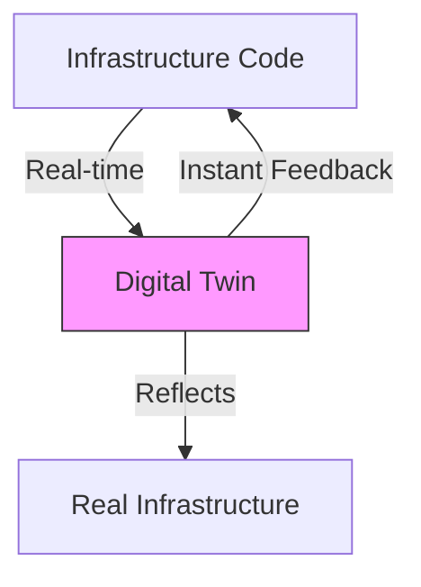
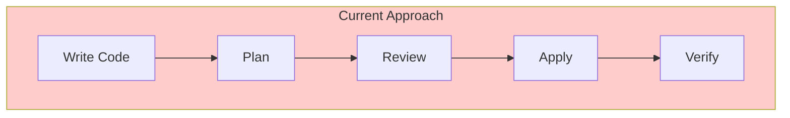
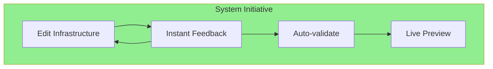

# Future Trends & Alternative Approaches
Rethinking Infrastructure Management

<!--
# Speaker Notes
Setup (1 min):
- "Let's look at where infrastructure management might be heading..."
- Connect to limitations we've seen in current tools
-->

---
layout: two-cols-header
---

# System Initiative Approach
Reimagining Infrastructure as Digital Twins

::left::

::right::

## Key Concepts

- 1:1 resource mapping
- Real-time state tracking
- Instant validation
- Live collaboration
- Visual feedback

<!--
# Speaker Notes

Setup (1-2 mins):
- "Imagine infrastructure that gives instant feedback..."
- Compare to current workflow limitations

Key Concepts (3-4 mins):

1. Digital Twins
   - Perfect mirror of infrastructure
   - Real-time state reflection
   - Immediate validation
   - Live updates

2. Real-world Impact
   - No more delayed feedback
   - Catch issues immediately
   - Collaborate in real-time
   - See changes instantly

3. Differences from Current Tools
   - Traditional: Plan → Apply → Wait
   - System Initiative: Instant Feedback Loop
   - Traditional: Static Files
   - System Initiative: Live Environment

Connect to Their Experience:
- "Think about game development environments"
- "Like live reload in web development"
- "Similar to real-time collaboration in Google Docs"

Questions to Ask:
- "How would this change your workflow?"
- "Where would instant feedback help most?"
- "What challenges do you see with this approach?"
-->

---
layout: center
---

# Current vs Future

<!--
# Speaker Notes

Setup (1 min):
- "Let's compare the workflows..."

Key Differences (3-4 mins):

1. Feedback Speed
   - Current: Minutes to hours
   - Future: Milliseconds
   - Impact on development speed
   - Error detection

2. Validation Approach
   - Current: Separate steps
   - Future: Continuous
   - Built-in safety
   - Earlier problem detection

3. Team Collaboration
   - Current: Async reviews
   - Future: Real-time collaboration
   - Shared understanding
   - Faster iterations

Real-world Connection:
- Like modern development environments
- Similar to collaborative tools
- Evolution of developer experience

Questions to Explore:
- "Which workflow looks better to you?"
- "Where would this help most?"
- "What challenges do you see?"

End with Future Vision:
- Infrastructure as responsive environment
- Teams working together in real-time
- Faster, safer changes
- Better developer experience
-->