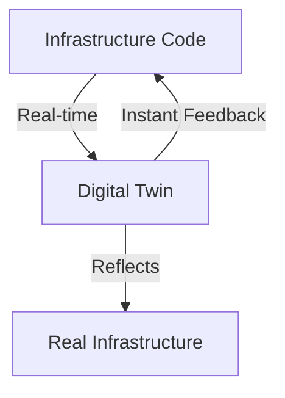
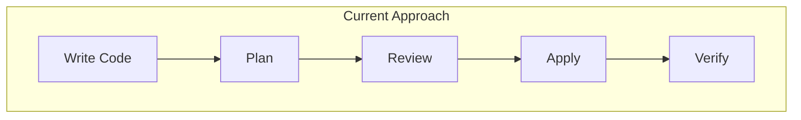
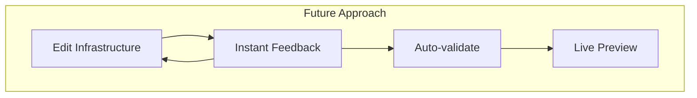

# Future Trends & Alternative Approaches

Rethinking Infrastructure Management

<!--
# Speaker Notes
Setup (1 min):
- "Let's look at where infrastructure management might be heading..."
- Connect to limitations we've seen in current tools
-->

---
layout: two-cols-header
hideInToc: true
---

# System Initiative Approach
Digital twins for infrastructure management

::left::

::right::

  
🔄 Key Features

  <ul class="text-sm">
    <li>1:1 resource mapping</li>
    <li>Real-time state tracking</li>
    <li>Instant validation</li>
    <li>Live collaboration</li>
    <li>Visual feedback</li>
  </ul>

  
💡 Benefits

  <ul class="text-sm">
    <li>Immediate feedback loop</li>
    <li>Error prevention</li>
    <li>Team coordination</li>
    <li>Visual understanding</li>
  </ul>

<!--
# Speaker Notes

Setup (1-2 mins):
- "Imagine infrastructure that gives instant feedback..."
- Compare to current workflow limitations

Key Concepts (3-4 mins):

1. Digital Twins
   - Perfect mirror of infrastructure
   - Real-time state reflection
   - Immediate validation
   - Live updates

2. Real-world Impact
   - No more delayed feedback
   - Catch issues immediately
   - Collaborate in real-time
   - See changes instantly

3. Differences from Current Tools
   - Traditional: Plan → Apply → Wait
   - System Initiative: Instant Feedback Loop
   - Traditional: Static Files
   - System Initiative: Live Environment

Connect to Their Experience:
- "Think about game development environments"
- "Like live reload in web development"
- "Similar to real-time collaboration in Google Docs"

Questions to Ask:
- "How would this change your workflow?"
- "Where would instant feedback help most?"
- "What challenges do you see with this approach?"
-->

---
layout: center
hideInToc: true
---

# Current vs Future Workflow
Evolution of infrastructure management approaches

  

    
Current Process

    

      
Characteristics

      <ul>
        <li>Sequential steps</li>
        <li>Manual validation</li>
        <li>Delayed feedback</li>
        <li>Complex coordination</li>
      </ul>
    

  

  

    
Future Process

    

      
Characteristics

      <ul>
        <li>Continuous feedback</li>
        <li>Automated validation</li>
        <li>Real-time preview</li>
        <li>Team awareness</li>
      </ul>
    

  

<!--
# Speaker Notes

Setup (1 min):
- "Let's compare the workflows..."

Key Differences (3-4 mins):

1. Feedback Speed
   - Current: Minutes to hours
   - Future: Milliseconds
   - Impact on development speed
   - Error detection

2. Validation Approach
   - Current: Separate steps
   - Future: Continuous
   - Built-in safety
   - Earlier problem detection

3. Team Collaboration
   - Current: Async reviews
   - Future: Real-time collaboration
   - Shared understanding
   - Faster iterations

Real-world Connection:
- Like modern development environments
- Similar to collaborative tools
- Evolution of developer experience

Questions to Explore:
- "Which workflow looks better to you?"
- "Where would this help most?"
- "What challenges do you see?"

End with Future Vision:
- Infrastructure as responsive environment
- Teams working together in real-time
- Faster, safer changes
- Better developer experience
-->